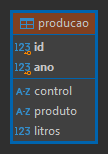
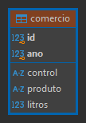
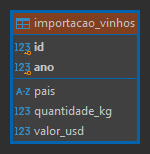
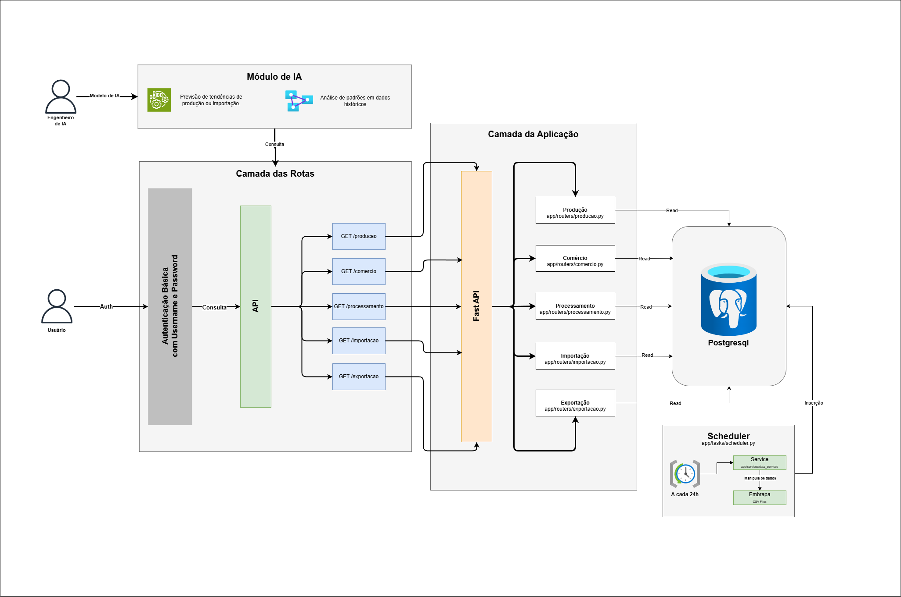

# TechChallenge 01 - 4MLET

### 🎯 Objetivo do Projeto
A API desenvolvida visa gerenciar dados de vitivinicultura, oferencendo funcionalidades
como leitura dos dados  de processamento, importação, produção e comércio. O sistema
permite o consumo seguro dos dados com autenticação básica de username e senha, além
de possibilitar o uso desses dados para futuras integrações com sistemas de inteligência
artificial.

***

## 📂 Estrutura do Projeto

- ### Camada de Rotas
  -  Roteamento das operações de produção, comércio, processamento, importação e exportação.
- ### Camada da Aplicação
  - API construída com FastAPI, protegida por autenticação básica.
- ### Banco de dados
  - PostgreSQL para armazenamento de dados.
- ### Scheduler
  - Rotinas periódicas para atualização dos dados provenientes de arquivos CSV da Embrapa.

***

## 🛠️ O que foi implementado?

### 1.  Rotas Principais:
   - /api/producao/{tipo}: Dados relacionados à produção.
   - /api/comercio: Dados relacionados ao comércio.
   - /api/processamento: Dados relacionados ao processamento.
     - /viniferas: Listar processamento Viniferas.
     - /americanas: Listar processamento Americanas.
     - /uvas-de-mesas: Listar processamento Uvas de Mesas.
     - /sem-classificacao: Listar processamento Sem Classificação.
   - /api/importacao/{tipo}: Dados relacionados à importação.
     - /vinhos: Listar importação de Vinhos.
     - /sucos: Listar importação de Sucos.
     - /passas: Listar importação de Passas.
     - /frescas: Listar importação de Frescas.
     - /espumantes: Listar importação de Espumantes.
   - /api/exportacao/{tipo}: Dados relacionados à exportação.
     - /vinhos: Listar exportação de Vinhos.
     - /sucos: Listar exportação de Sucos.
     - /frescas: Listar exportação de Frescas.
     - /espumantes: Listar exportação de Espumantes.

|  |  |                                |
|------------------------|-------------------------|-------------------------------------------------------|
| Diagrama de Produção   | Diagrama de Comércio    | Diagrama de Processamento<br/>(Padrão para os outros tipos) |
   
|                                     |                                     |
|------------------------------------------------------------|------------------------------------------------------------|
| Diagrama de Importação <br/> (Padrão para os outros tipos) | Diagrama de Exportação <br/> (Padrão para os outros tipos) |
### 2. Autenticação Básica:
   - Proteção de rotas com autenticação de usuário e senha.
   
### 3.  CRUD de Usuários:
   - Permite criar, listar e gerenciar usuários para a API.

### 4.  Manipulação de Arquivos CSV:
   - Pipeline para download, processamento e armazenamento dos dados no banco.
   
### 5.  Scheduler:
   - Atualização automática de dados a cada 24h.
   
### 6.  Preparação para Consumo por IA:
   - Estruturação dos dados para futuros projetos de inteligência artificial.

***

## 🌐 Arquitetura do Projeto



***

## 🚀 Passo a Passo para Reproduzir o Projeto:

### 1. Pré-requisitos
    - Python 3.10 ou superior
    - PostgreSQL configurado e rodando
    - pip para gerenciamento de pacotes

### 2. Clonar o Repositório
```bash
git clone https://github.com/Guidev001/vitivinicultura-api.git
cd vitivinicultura-api
```

### 3. Configure o Ambiente Virtual
```bash
python -m venv venv
source venv/bin/activate # Linux/MacOS
venv\Scripts\activate # Windows
```

### 4. Instale as Dependências
```bash
pip install -r requirements.txt
```

### 5. Configure as Variáveis de Ambiente
```makefile
cp .env.example .env
```

### 6. Execute a Aplicação
```bash
uvicorn app.main:app --reload
```

### 7. Acesse a Documentação
    - Documentação Swagger: http://localhost:8000/docs

***

## 🔒 Autenticação
- O sistema utiliza autenticação básica (username e password) para proteger as rotas.
- Para acessar as rotas protegidas, utilize as credenciais padrão:
  - Username: admin
  - Password: admin

***

## 🤖 Futuro Consumo de IA
Os dados estruturados podem ser utilizados em projetos de:
- Previsão de tendências de produção ou importação.
- Análise de padrões em dados históricos

***

## 🧑‍💻 Desenvolvedor
- [Guilherme Gomes David - RM360151](https://github.com/Guidev001)